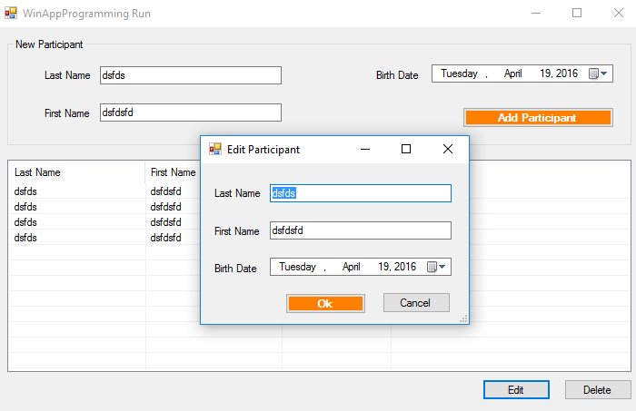

# Windows Forms – Dialogs

##### Activity

 Sample code available at <http://online.ase.ro> – “DialogSample” Sample

1. Create a copy of the “BasicListView” project and name it “DialogSample”

2. Create the following UI


3. Name the “Edit” button “btnEdit” and the “Delete” button “btnDelete”

4. Modify the “DisplayParticipants” method in the “MainForm” class in order to set the “Tag” property for the ListViewItem instances, as shown bellow.

```c#
public void DisplayParticipants()
{
	lvParticipants.Items.Clear();

	foreach (Participant participant in _participants)
	{
		var listViewItem = new ListViewItem(participant.LastName);
		listViewItem.SubItems.Add(participant.FirstName);
		listViewItem.SubItems.Add(participant.BirthDate.ToShortDateString());
		
		//add this line
		listViewItem.Tag = participant;
		
		lvParticipants.Items.Add(listViewItem);
	}
}
```

5. Handle the “Click” event for the “btnDeletet” button as follows

```c#
if (lvParticipants.SelectedItems.Count == 0)
{
	MessageBox.Show("Choose a participant");
	return;
}

if (MessageBox.Show("Are you sure?", "Delete participant", MessageBoxButtons.YesNo, MessageBoxIcon.Warning) ==
	DialogResult.Yes)
{
	_participants.Remove((Participant) lvParticipants.SelectedItems[0].Tag);
	DisplayParticipants();
}
```

6. Add a new Form to the project and name it “EditForm”

7. Create the following UI



8. Rename the controls as “tbLastName”, “tbFirstName” and “dtpBirthDate”

9. Change the EditForm class, so that it is defined as follow

```c#
#region Attributes
private readonly Participant _participant;
#endregion


public EditForm(Participant participant)
{
	_participant = participant;
	InitializeComponent();
}
private void EditForm_Load(object sender, System.EventArgs e)
{
	tbLastName.Text = _participant.LastName;
	tbFirstName.Text = _participant.FirstName;
	dtpBirthDate.Value = _participant.BirthDate;
}
```

10. Set the DialogResult for the “Cancel” button as “Cancel”


11. Rename the “Ok” button as “btnOk”

12. Set the DialogResult for the “Ok” button as “OK”


13. Handle the “Click” event for the “btnOk” button as follows

```c#
_participant.LastName = tbLastName.Text;
_participant.FirstName = tbFirstName.Text;
_participant.BirthDate = dtpBirthDate.Value;
```

14. Handle the “Click” event for the “Edit” button in the “MainForm” as follows:

```c#
if (lvParticipants.SelectedItems.Count == 0)
{
	MessageBox.Show("Choose a participant");
	return;
}

EditForm editForm = new EditForm((Participant)lvParticipants.SelectedItems[0].Tag);
if (editForm.ShowDialog() == DialogResult.OK)
	DisplayParticipants();
```

#### Homework
1. Besides the “Edit” button, also allow the user to edit the participants by double clicking on them in the ListView
2. Display a contextual menu when the user right clicks on a participant in the ListView. The contextual menu will include the options to edit or delete the participant.
