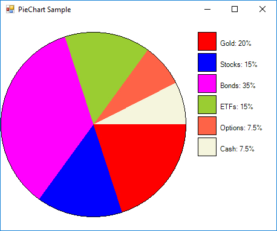
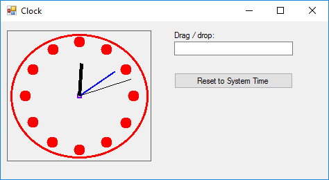
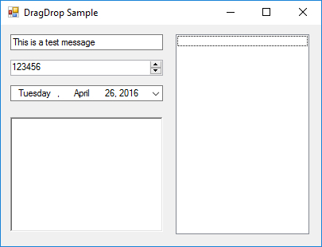
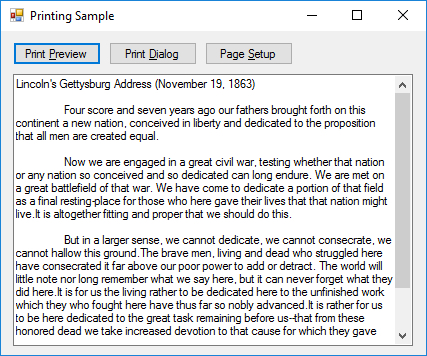

# Windows Forms – UserControl, Drawing, Drag and Drop, Printing

##	 Contents

1. [Chart Control](#chart-control)
2. [UserControl](#usercontrol)
3. [Drawing](#drawing)
4. [Drag and Drop](#drag-and-drop)
5. [Printing](#printing)
6. [Further Reading](#further-reading)
	1. [Unit Testing](#unit-testing)

## <a name="chart-control"></a>Chart Control

## <a name="usercontrol"></a> UserControl

**Activity**

 Sample Code available at <http://online.ase.ro> – “PieChartGraphicsSample” Sample  


1. Create a new project with the name “PieChartGraphicsSample”
2. Add a new class “PieChartCategory”, defined as follows:

	```c#
	internal class PieChartCategory
	{
		public string Description { get; set; }
		
		public float Percentage { get; set; }
		
		public Color Color { get; set; }
		
		public PieChartCategory(string description, float percent, Color color)
		{
			Description = description;
			Percentage = percent;
			Color = color;
		}
	}
	```
3. Add a new UserControl and name it “PieChartControl”  

4. Add the “Data “ property in the “PieChartControl” class

	```c#
		private PieChartCategory[] _data;
		public PieChartCategory[] Data {
			get { return _data; }
			set
			{
				if(_data == value)
					return;
	
				_data = value;
				
				//trigger the Paint event
				Invalidate();
			}
		}
	```

## <a name="drawing"></a>Drawing

The Graphics class provides methods for drawing objects to the display device.

**Activity**

1. Modify the constructor of the “PieChartControl” class as follows:
	
	```c#
	public PieChartControl()
	{
		InitializeComponent();
	
		//redraws if resized
		ResizeRedraw = true;
		
		//Default data
		Data = new[]
		{
			new PieChartCategory("Category 1", 20, Color.Red),
			new PieChartCategory("Category 2", 80, Color.Blue)
		};
	}
	```
2. Handle the “Paint” event for the “PieChartControl” as follows:

	```c#
	private void PieChartControl_Paint(object sender, PaintEventArgs e)
	{
		//width reserved for displaying the legend
		int legendWidth = 150;
		
		//get the drawing context
		Graphics graphics = e.Graphics;
		//get the drqwing area
		Rectangle clipRectangle = e.ClipRectangle;
		
		//compute the maximum radius
		float radius = Math.Min(clipRectangle.Height, clipRectangle.Width - legendWidth) / (float)2;
		
		//determine the center of the pie
		int xCenter = (clipRectangle.Width - legendWidth) / 2;
		int yCenter = clipRectangle.Height / 2;
		
		//determine the x and y coordinate of the pie
		float x = xCenter - radius;
		float y = yCenter - radius;
		
		//determine the width and the height
		float width = radius * 2;
		float height = radius * 2;
		
		//draw the pie sectors
		float percent1 = 0;
		float percent2 = 0;
		for (int i = 0; i < Data.Length; i++)
		{
			if (i >= 1)
				percent1 += Data[i - 1].Percentage;
				
			percent2 += Data[i].Percentage;
			
			float angle1 = percent1 / 100 * 360;
			float angle2 = percent2 / 100 * 360;
			
			Brush b = new SolidBrush(Data[i].Color);
			
			graphics.FillPie(b, x, y, width, height, angle1, angle2 - angle1);
		}
		
		//draw the pie contour
		Pen pen = new Pen(Color.Black);
		graphics.DrawEllipse(pen, x, y, width, height);
		
		//draw the chart legend
		float xpos = x + width + 20;
		float ypos = y;
		for (int i = 0; i < Data.Length; i++)
		{
			Brush b = new SolidBrush(Data[i].Color);
			graphics.FillRectangle(b, xpos, ypos, 30, 30);
			graphics.DrawRectangle(pen, xpos, ypos, 30, 30);
			Brush b2 = new SolidBrush(Color.Black);
			graphics.DrawString(Data[i].Description + ": " + Data[i].Percentage + "%",
			Font, b2,
			xpos + 35, ypos + 12);
			ypos += 35;
		}
	}
	```
3. Add the “PieChartControl” to the “MainForm” (using the Toolbox)
4. Handle the “Load” event for the “MainForm” as follows:

	```c#
	private void MainForm_Load(object sender, System.EventArgs e)
	{
		PieChartCategory[] pieCategories = {
			new PieChartCategory("Gold", 20, Color.Red),
			new PieChartCategory("Stocks", 15, Color.Blue),
			new PieChartCategory("Bonds", 35, Color.Magenta),
			new PieChartCategory("ETFs", 15, Color.YellowGreen),
			new PieChartCategory("Options", (float) 7.5, Color.Tomato),
			new PieChartCategory("Cash", (float) 7.5, Color.Beige)
		};
		
		pieChartControl1.Data = pieCategories;
	}
	```
	
**Activity**

 Sample Code available at <http://online.ase.ro> – “ClockUserControlSample” Sample  

	
## <a name="drag-and-drop"></a>Drag and Drop

Further reading: <https://msdn.microsoft.com/en-us/library/aa984430%28v=vs.71%29.aspx>

**Activity**

 Sample Code available at <http://online.ase.ro> – “DragDropSample” Sample 

1. Create a new project with the name “DragDropSample”
2. Create the UI shown below  

3. Set the “AllowDrop” property of the ListView to true  

4. Handle the “MouseDown” event for the TextBox as follows:
	
	```c#
	textBox1.DoDragDrop(textBox1.Text, DragDropEffects.Copy);
	```
5. Handle the “DragEnter” event for the ListView as follows:

	```c#
	// Display some information about the DragDrop information in the
	// richTextBox1 control to show some of the information available.
	richTextBox1.Text = "Allowed Effect: " + e.AllowedEffect +
	"\r\nAvailable Formats:\r\n";
	
	// Data may be available in more than one format, so loop through
	// all available formats and display them in richTextBox1.
	foreach (string availableFormat in e.Data.GetFormats(true))
	{
		richTextBox1.Text += "\t" + availableFormat + "\r\n";
	}
	
	// This control will use any dropped data to add items to the listbox.
	// Therefore, only data in a text format will be allowed. Setting the
	// autoConvert parameter to true specifies that any data that can be
	// converted to a text format is also acceptable.
	if (e.Data.GetDataPresent(DataFormats.Text, true))
	{
		// Some controls in this sample allow both Copy and Move effects.
		// If a Move effect is allowed, this implementation assumes a Move
		// effect unless the CTRL key was pressed, in which case a Copy
		// effect is assumed. This follows standard DragDrop conventions.
		if ((e.AllowedEffect & DragDropEffects.Move) == DragDropEffects.Move && (e.KeyState & CtrlKey) != CtrlKey)
		{
			// Show the standard Move icon.
			e.Effect = DragDropEffects.Move;
		}
		else
		{
			// Show the standard Copy icon.
			e.Effect = DragDropEffects.Copy;
		}
	}
	```
6. Handle the “DragDrop” event for the ListView as follows:
	
	```c#
	/// <summary>
	/// The DragDrop event of the target control fires when a drop actually occurs over
	/// the target control. This is where the data being dragged is actually processed.
	///
	/// This event will fire only if the AllowDrop property of the target control has
	/// been set to true.
	/// </summary>
	/// <param name="sender">The source of the event.</param>
	/// <param name="e">A DragEventArgs that contains the event data.</param>
	private void listBox1_DragDrop(object sender, DragEventArgs e)
	{
		if (e.Data.GetDataPresent(DataFormats.Text, true))
		{
			// Create the list item using the data provided by the source control.
			listBox1.Items.Add(e.Data.GetData(DataFormats.Text));
		}
	}
	```

## <a name="printing"></a>Printing

**Activity**

 Sample Code available at <http://online.ase.ro> – “PrintingSample” Sample



## <a name="further-reading"></a>Further reading

### <a name="unit-testing"></a>Unit Testing

 Further reading: [link](https://msdn.microsoft.com/en-us/library/hh694602.aspx)