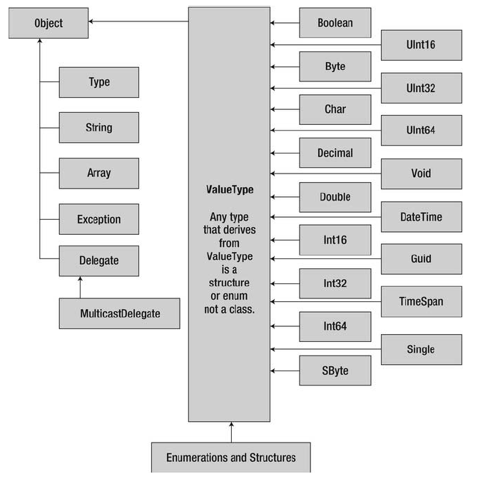
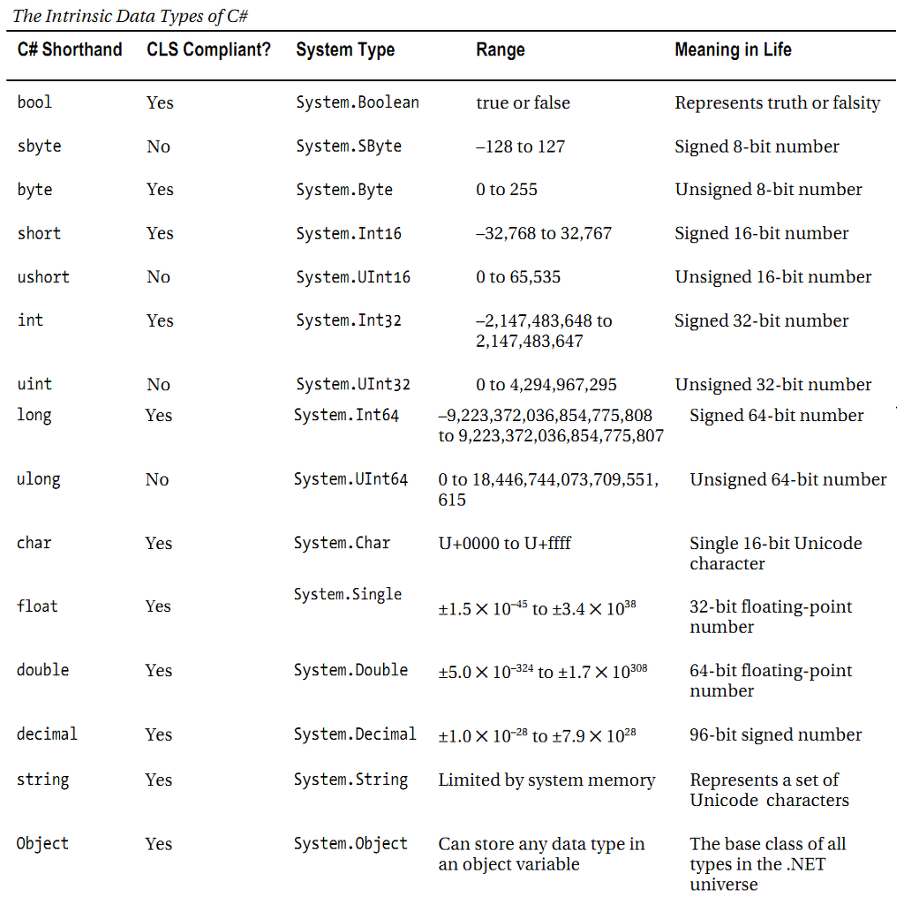

# 1. Introduction
## 1.1. Prerequisites
Visual Studio 2013 / 2015 / 2017 (can be downloaded from http://microsoft.ase.ro or http://www.dreamspark.com/ )
## 1.2. API Reference
https://msdn.microsoft.com/en-us/library/
https://msdn.microsoft.com/en-us/library/w0x726c2%28v=vs.110%29.aspx
## 1.3. Official Samples
https://code.msdn.microsoft.com
# 2. First C# Program
## 2.1. The Main() method
Every C# application must contain a single Main method specifying where program execution is to begin.
Observations:
* in C#, Main is capitalized, while Java uses lowercase main;
* note the static modifier which has a similar behavior with C++.

Activity: 
*	create a new Microsoft .NET Project in Visual Studio;
*	add the following code.

```C#
using System; //referenced namespace

namespace NameSpaceProgram 
{
	internal class Program
	{
		private static void Main(string[] args)
		{
			//HelloWorld application
			Console.WriteLine("Hello World!");
			Console.ReadLine();
		} //end main
	}//end class
} //end namespace
```
Activity: 
-	download dotPeak from https://www.jetbrains.com/decompiler/;
-	decompile the HelloWorld application.

##	2.2. Reading and Writing using System.Console
Documentation: https://msdn.microsoft.com/en-us/library/system.console(v=vs.110).aspx

Frequently used methods:
-	Write / WriteLine;
-	Read / Readline.

## 2.3.	Formatting Console Output

```C#
Console.WriteLine("Argument: {0}", 10);
Console.WriteLine("{1}, {0}, {2}", 10, 20, 30);
Console.WriteLine("c format: {0:c}", 99999);
```

## 2.4.	Specifying an Application Error Code
the Main() method can only return int or void;

Activity:
-	replace the code from the previous activity with the following one.

```C#
static int Main(string[] args)
{
	Console.WriteLine("Hello World!");
	Console.ReadLine();
	// Return an arbitrary error code.
	return -1;
}
```

```
@echo off

NameofYourApp 

@if "%ERRORLEVEL%" == "0" goto success
:fail
echo This application has failed!
echo return value = %ERRORLEVEL%
goto end
:success
echo This application has succeeded!
echo return value = %ERRORLEVEL%
goto end
:end
echo All Done.
```
## 2.5.	Processing Command-Line Arguments
the Main() method has an optional string array argument to represent command-line parameters.
Activity:
- replace the code from the previous activity with the following one.

```C#
public static void Main(string[] args)
    {
        foreach (string arg in args)
        {
            Console.WriteLine("Argument: {0}", arg);
        }
    }
```
```
NameofYourApp.exe /arg1 -arg2
```

# 3.	Data Types

Some of these types have shorthand defined in C#, as shown in the following table.


## 3.1.	Value types
-	structure, enum, primitive types (derived from System.ValueType)
-	allocated: on the stack;
-	lifetime: can be created and destroyed very quickly, as its lifetime is determined by the defining scope;

##3.2.	Reference types
-	class, delegate, interface
-	allocated: in the heap;
-	lifetime: has a lifetime that is determined by a large number of factors

|                                                  | Value type                                                                                            | Reference Type                                                                                         |
|--------------------------------------------------|-------------------------------------------------------------------------------------------------------|--------------------------------------------------------------------------------------------------------|
| Where are objects allocated?                     | Allocated on the stack.                                                                               | Allocated on the managed heap.                                                                         |
| How is a variable represented?                   | Value type variables are local copies.                                                                | Reference type variables are pointing to the memory occupied by the allocated instance.                |
| What is the base type?                           | Implicitly extends System.ValueType.                                                                  | Can derive from any other type (except System.ValueType), as long as that type is not “sealed”.        |
| Can this type function as a base to other types? | No. Value types are always sealed and cannot be inherited from.                                       | Yes. If the type is not sealed, it may function as a base to other types.                              |
| Default parameter passing behavior               | Variables are passed by value (i.e., a copy of the variable is passed into the called function).      | For value types, the object is copied-by-value. For reference types, the reference is copied-by-value. |
| Own constructor for this type                    | Yes, but the default constructor is reserved (i.e., the custom constructors must all have arguments). | Yes                                                                                                    |
| When do variables of this type die?              | When they fall out of the defining scope.                                                             | When the object is garbage collected.                                                                  |


Table: Table 1 Comparison between value types and reference types

